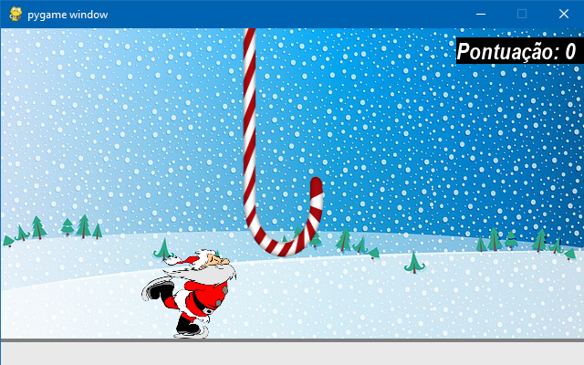

# Projeto De Corrida de Obstáculos
> Projeto criando uma corrida de obstáculos parecida ao do Google quando está sem conexão com internet.

Este projeto tem por objetivo criar um jogo interativo de corrida de obstáculos que vai aumentando a velocidade dos obstáculos conforme o usuário vai avançando e ganhando pontos até um máximo. É um ótimo joguinho para se passar o tempo e o visual é bastante satisfatório também.

___

## Módulos Necessários
Neste projeto, foram utilizados o pygame para criar o jogo e a interface gráfica, Playsound para a música, além do time para a parte da velocidade e o próprio OS.
Para instalar o pygame 
`pip install pygame`
Para instalar playsound 
`pip install playsound`

## Usos
Este projeto é um bom inicio para aprender a criar pequenos jogos simples pelo python e entender um pouco de mecânicas de construção dos mesmos. Além de ser um excelente jeito de passar o tempo jogando.

## Meta
Gregory Wells de Carvalho Barteles - gregorywells93@gmail.com.